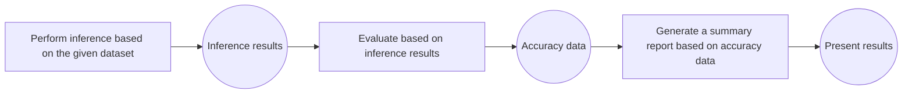

# Service-Oriented Accuracy Evaluation
In a service-oriented deployment environment, the accuracy of the model in real service scenarios is evaluated by comparing model outputs with standard answers through standardized requests. It supports multiple datasets and backend configurations, facilitating the comparison of model accuracy across different service-oriented solutions.


## Preconditions for Service-Oriented Accuracy Evaluation
Before performing service-oriented inference, the following conditions must be met:

- Accessible service-oriented model service: Ensure the service process can be directly accessed in the current environment.
- Dataset task preparation:
  - Open-source datasets: Select a dataset from 📚 [Open-Source Datasets](../all_params/datasets.md#open-source-datasets), and choose the dataset task to execute from the "detailed introduction" document corresponding to the dataset. Prepare the dataset files by referring to the "detailed introduction" document of the selected dataset task. It is recommended to manually place the open-source dataset in the default directory `ais_bench/datasets/`; the program will automatically load the dataset files during task execution.
  - Custom datasets: No need to specify a dataset task; refer to 📚 [Custom Dataset](../../advanced_tutorials/custom_dataset.md) for other configurations.
- Model task preparation: Select the model task to execute from 📚 [Service-Oriented Inference Backend](../all_params/models.md#service-oriented-inference-backend).


## Main Functional Scenarios
### Single-Task Evaluation
Please refer to 📚 [Quick Start](../../get_started/quick_start.md) on the homepage for details; no further elaboration here.

### Multi-Task Evaluation
It supports configuring multiple models or multiple dataset tasks simultaneously and conducting batch evaluations with a single command, which is suitable for large-scale model horizontal comparison or multi-dataset accuracy comparison analysis.

#### Command Description
Users can specify multiple configuration tasks via the `--models` and `--datasets` parameters. The number of subtasks is the product of the number of tasks configured by `--models` and `--datasets`—that is, one model configuration and one dataset configuration form a subtask. Example command:
```bash
ais_bench --models vllm_api_general_chat vllm_api_stream_chat --datasets gsm8k_gen_4_shot_cot_str aime2024_gen_0_shot_chat_prompt
```
The above command specifies 2 model tasks (`vllm_api_general_chat`, `vllm_api_stream_chat`) and 2 dataset tasks (`gsm8k_gen_4_shot_cot_str`, `aime2024_gen_0_shot_chat_prompt`), and will execute the following 4 combined accuracy test tasks:

+ [vllm_api_general_chat](https://github.com/AISBench/benchmark/tree/master/ais_bench/benchmark/configs/models/vllm_api/vllm_api_general_chat.py) model task + [gsm8k_gen_4_shot_cot_str](https://github.com/AISBench/benchmark/tree/master/ais_bench/benchmark/configs/datasets/gsm8k/gsm8k_gen_4_shot_cot_str.py) dataset task
+ [vllm_api_general_chat](https://github.com/AISBench/benchmark/tree/master/ais_bench/benchmark/configs/models/vllm_api/vllm_api_general_chat.py) model task + [aime2024_gen_0_shot_chat_prompt](https://github.com/AISBench/benchmark/tree/master/ais_bench/benchmark/configs/datasets/aime2024/aime2024_gen_0_shot_chat_prompt.py) dataset task
+ [vllm_api_stream_chat](https://github.com/AISBench/benchmark/tree/master/ais_bench/benchmark/configs/models/vllm_api/vllm_api_stream_chat.py) model task + [gsm8k_gen_4_shot_cot_str](https://github.com/AISBench/benchmark/tree/master/ais_bench/benchmark/configs/datasets/gsm8k/gsm8k_gen_4_shot_cot_str.py) dataset task
+ [vllm_api_stream_chat](https://github.com/AISBench/benchmark/tree/master/ais_bench/benchmark/configs/models/vllm_api/vllm_api_stream_chat.py) model task + [aime2024_gen_0_shot_chat_prompt](https://github.com/AISBench/benchmark/tree/master/ais_bench/benchmark/configs/datasets/aime2024/aime2024_gen_0_shot_chat_prompt.py) dataset task

#### Modify Configuration Files Corresponding to Tasks
The actual paths of the configuration files for model tasks and dataset tasks can be queried by executing the command with the `--search` parameter:
```bash
ais_bench --models vllm_api_general_chat vllm_api_stream_chat --datasets gsm8k_gen_4_shot_cot_str aime2024_gen_0_shot_chat_prompt --search
```
The following configuration files to be modified will be queried:
```bash
╒═════════════╤═════════════════════════════════╤═══════════════════════════════════════════════════════════════════════════════════════════════════════════════════════════════════╕
│ Task Type   │ Task Name                       │ Config File Path                                                                                                                  │
╞═════════════╪═════════════════════════════════╪═══════════════════════════════════════════════════════════════════════════════════════════════════════════════════════════════════╡
│ --models    │ vllm_api_general_chat           │ /your_workspace/benchmark_test/ais_bench/benchmark/configs/models/vllm_api/vllm_api_general_chat.py                               │
├─────────────┼─────────────────────────────────┼───────────────────────────────────────────────────────────────────────────────────────────────────────────────────────────────────┤
│ --models    │ vllm_api_stream_chat            │ /your_workspace/benchmark_test/ais_bench/benchmark/configs/models/vllm_api/vllm_api_stream_chat.py                                │
├─────────────┼─────────────────────────────────┼───────────────────────────────────────────────────────────────────────────────────────────────────────────────────────────────────┤
│ --datasets  │ gsm8k_gen_4_shot_cot_str        │ /your_workspace/benchmark_test/ais_bench/benchmark/configs/datasets/gsm8k/gsm8k_gen_4_shot_cot_str.py                             │
├─────────────┼─────────────────────────────────┼───────────────────────────────────────────────────────────────────────────────────────────────────────────────────────────────────┤
│ --datasets  │ aime2024_gen_0_shot_chat_prompt │ /your_workspace/benchmark_test/ais_bench/benchmark/configs/datasets/aime2024/aime2024_gen_0_shot_chat_prompt.py                   │
╘═════════════╧═════════════════════════════════╧═══════════════════════════════════════════════════════════════════════════════════════════════════════════════════════════════════╛
```
- Refer to 📚 [Service-Oriented Inference Backend Configuration Parameter Description](../all_params/models.md#parameter-description-for-local-model-backend-configuration) to configure the configuration files corresponding to the model tasks `vllm_api_general_chat` and `vllm_api_stream_chat` according to the actual situation.
- Refer to 📚 [Configure Open-Source Datasets](../all_params/datasets.md#configuring-open-source-datasets) to configure the configuration files corresponding to the dataset tasks `gsm8k_gen_4_shot_cot_str` and `aime2024_gen_0_shot_chat_prompt` according to the actual situation. **Note**: If the dataset is placed in the default directory `ais_bench/datasets/`, no configuration is generally required.

#### Execute the Evaluation Command
Execute the command:
```bash
ais_bench --models vllm_api_general_chat vllm_api_stream_chat --datasets gsm8k_gen_4_shot_cot_str aime2024_gen_0_shot_chat_prompt
```
During execution, a timestamp directory will be created under the path specified by 📚 [`--work-dir`](../all_params/cli_args.md#common-parameters) (default: `outputs/default/`) to store execution details.

After the task is completed, an example of the on-screen log showing the results is as follows:
```bash
dataset    version    metric    mode      vllm-api-general-chat    vllm-api-stream-chat
---------  ---------  --------  ------  -----------------------  ----------------------
gsm8k      84f965     accuracy  gen                        56.70                    55.97
aime2024   604a78     accuracy  gen                        50.00                    50.00
```
At the same time, the final generated directory structure is as follows:
```bash
# Under output/default
20250628_172032/     # Output directory corresponding to the task creation time
├── configs          # A combined configuration file of the configuration files for model tasks, dataset tasks, and structure presentation tasks
│   └── 20250628_172032_4469.py
├── logs             # Logs including inference and accuracy evaluation phases
│   ├── eval         # Logs of the accuracy calculation phase
│   │   ├── vllm-api-general-chat
│   │   │   ├── aime2024.out
│   │   │   └── gsm8k.out
│   │   └── vllm-api-stream-chat
│   │       ├── aime2024.out
│   │       └── gsm8k.out
│   └── infer        # Logs of the inference phase
│       ├── vllm-api-general-chat
│       │   ├── aime2024.out
│       │   └── gsm8k.out
│       └── vllm-api-stream-chat
│           ├── aime2024.out
│           └── gsm8k.out
├── predictions      # Inference result files, recording the input of each request, model output, and reference answers (for accuracy calculation)
│   ├── vllm-api-general-chat
│   │   ├── aime2024.json
│   │   └── gsm8k.json
│   └── vllm-api-stream-chat
│       ├── aime2024.json
│       └── gsm8k.json
├── results         # Accuracy evaluation results generated based on predictions
│   ├── vllm-api-general-chat
│   │   ├── aime2024.json
│   │   └── gsm8k.json
│   └── vllm-api-stream-chat
│       ├── aime2024.json
│       └── gsm8k.json
└── summary        # Summary view of accuracy results, including CSV, Markdown, and TXT formats
    ├── summary_20250628_172032.csv
    ├── summary_20250628_172032.md
    └── summary_20250628_172032.txt
```

### Multi-Task Parallel Evaluation
By default, multiple subtasks are executed serially. Continuous Batch is enabled by default within a single task, and multiple processes will be launched to send and process requests according to the maximum concurrency configured by the user, allowing for large concurrency settings. When the concurrency of a single task is low, multi-task parallelism can be achieved by setting the 📚 [`--max-num-workers`](../all_params/cli_args.md#accuracy-evaluation-parameters) parameter. Example as follows:
```bash
ais_bench --models vllm_api_general_chat vllm_api_stream_chat --datasets gsm8k_gen_4_shot_cot_str aime2024_gen_0_shot_chat_prompt --max-num-workers 4
```

In the example above, the maximum number of concurrent tasks is set to 4, so four subtasks will be executed simultaneously. This can be viewed on the command line dashboard:

```
Base path of result&log : outputs/default/20251106_113926
Task Progress Table (Updated at: 2025-11-06 11:39:58)
Page: 1/1  Total 5 rows of data
Press Up/Down arrow to page,  'P' to PAUSE/RESUME screen refresh, 'Ctrl + C' to exit

+--------------------------------+-----------+----------------------------------------------------+-------------+-------------+-----------------------------------------------+---------------------------------------------------+
| Task Name                      |   Process | Progress                                           | Time Cost   | Status      | Log Path                                      | Extend Parameters                                 |
+================================+===========+====================================================+=============+=============+===============================================+===================================================+
| vllm-api-general-chat/gsm8k    |   1250142 | [                              ] 5/1319 [5.0 it/s] | 0:00:07     | inferencing | logs/infer/vllm-api-general-chat/gsm8k.out    | {'POST': 10, 'RECV': 5, 'FINISH': 5, 'FAIL': 0}   |
+--------------------------------+-----------+----------------------------------------------------+-------------+-------------+-----------------------------------------------+---------------------------------------------------+
| vllm-api-general-chat/aime2024 |   1250139 | [#####                         ] 5/30 [5.0 it/s]   | 0:00:07     | inferencing | logs/infer/vllm-api-general-chat/aime2024.out | {'POST': 10, 'RECV': 5, 'FINISH': 5, 'FAIL': 0}   |
+--------------------------------+-----------+----------------------------------------------------+-------------+-------------+-----------------------------------------------+---------------------------------------------------+
| vllm-api-stream-chat/gsm8k     |   1250143 | [                              ] 5/1319 [5.0 it/s] | 0:00:07     | inferencing | logs/infer/vllm-api-stream-chat/gsm8k.out     | {'POST': 10, 'RECV': 5, 'FINISH': 5, 'FAIL': 0}   |
+--------------------------------+-----------+----------------------------------------------------+-------------+-------------+-----------------------------------------------+---------------------------------------------------+
| vllm-api-stream-chat/aime2024  |   1250138 | [###############               ] 15/30 [5.0 it/s]  | 0:00:07     | inferencing | logs/infer/vllm-api-stream-chat/aime2024.out  | {'POST': 20, 'RECV': 15, 'FINISH': 15, 'FAIL': 0} |
+--------------------------------+-----------+----------------------------------------------------+-------------+-------------+-----------------------------------------------+---------------------------------------------------+
```

The generated result is consistent with the example in [Multi-Task Evaluation](#multi-task-evaluation).

### Resumption After Interruption & Retesting of Failed Cases
If the inference task fails due to an unexpected interruption or server exception during the evaluation, the breakpoint management function can be enabled via `--reuse` to resume the task. It also supports automatic retesting of only failed cases without re-running all tasks. Example as follows:

1. Assume the user first executes the inference evaluation with the following command. If the task is interrupted due to an abnormal exit or some requests fail due to server exceptions:
```bash
ais_bench --models vllm_api_general_chat --datasets demo_gsm8k_gen_4_shot_cot_chat_prompt
```
At this point, some inference results will be saved, and the following file content will be generated under the 📚 [`--work-dir`](../all_params/cli_args.md#common-parameters) directory:
```bash
# Under output/default
20250628_151326/ # Timestamp directory created by the test task
├── configs # A combined configuration file of the configuration files for model tasks, dataset tasks, and structure presentation tasks
│   └── 20250628_151326_29317.py
├── logs # Logs during execution; if --debug is added to the command, no process logs will be saved to disk (all will be printed directly)
│   └── infer # Logs of the inference phase
└── predictions # Directory for inference results, recording the input of each request, model output, and answers (for accuracy evaluation)
    └── vllm-api-general-chat
        └── tmp_demo_gsm8k   # Inference output of completed requests
                └── tmp_0_2766386_1749107195.json   # Cache file, named in the format: tmp_{task_process_ID}_{process_number}_{timestamp}.json
```

2. Resume the inference by specifying the task timestamp directory via the `--reuse` parameter:
```bash
ais_bench --models vllm_api_general --datasets gsm8k_gen --reuse 20250628_151326
```
The following content will be printed in the log, indicating that the resumption task has started:
```bash
02/20 13:14:15 - AISBench - INFO - Found 10 tmp items, run infer task from the last interrupted position
```
After the resumption is completed, the accuracy results of all requests will be recalculated and printed, and the generated results are consistent with the example in 📚 [Quick Start](../../get_started/quick_start.md).

> ⚠️ Note: Resumption after interruption and retesting of failed cases may change the order of requests, which may cause slight fluctuations in results.

💡 [Multi-Task Evaluation](#multi-task-evaluation) also supports resumption after interruption and retesting of failed cases for all or part of the tasks.
For example, if an interruption occurs when executing the following multi-task evaluation command:
```bash
ais_bench --models vllm_api_general_chat vllm_api_stream_chat --datasets gsm8k_gen_4_shot_cot_str aime2024_gen_0_shot_chat_prompt
```
Resume all tasks after interruption in the following way:
```bash
ais_bench --models vllm_api_general_chat vllm_api_stream_chat --datasets gsm8k_gen_4_shot_cot_str aime2024_gen_0_shot_chat_prompt --reuse 20250628_151326
```
You can also resume only part of the tasks in the following ways:
```bash
# Resume only the task of vllm_api_general_chat + gsm8k_gen_4_shot_cot_str
ais_bench --models vllm_api_general_chat --datasets gsm8k_gen_4_shot_cot_str --reuse 20250628_151326
# Resume the two tasks of vllm_api_general_chat + gsm8k_gen_4_shot_cot_str and vllm_api_general_chat + aime2024_gen_0_shot_chat_prompts
ais_bench --models vllm_api_general_chat --datasets gsm8k_gen_4_shot_cot_str aime2024_gen_0_shot_chat_prompt --reuse 20250628_151326
# Resume the two tasks of vllm_api_general_chat + aime2024_gen_0_shot_chat_prompts and vllm_api_stream_chat + aime2024_gen_0_shot_chat_prompts
ais_bench --models vllm_api_general_chat vllm_api_stream_chat --datasets aime2024_gen_0_shot_chat_prompt --reuse 20250628
```

### Merging Sub-dataset Inference
Some datasets are categorized into different sub-datasets, which will be split into multiple subtasks for inference during the inference process. Examples include 📚 [MMLU](https://github.com/AISBench/benchmark/tree/master/ais_bench/benchmark/configs/datasets/mmlu/README_en.md) and 📚 [CEVAL](https://github.com/AISBench/benchmark/tree/master/ais_bench/benchmark/configs/datasets/ceval/README_en.md). AISBench Benchmark supports merging datasets that consist of multiple small-scale datasets into a single task for unified evaluation. An example command is as follows:
```bash
ais_bench --models vllm_api_general --datasets ceval_gen --merge-ds
```
> ⚠️ Note: In merge mode, only the overall result will be generated, and the accuracy of individual sub-datasets will no longer be listed separately. Additionally, if you need to resume interrupted inference or re-run failed cases for inference results that were interrupted or failed in merge mode, you must also add `--merge-ds` to the command.


### Multiple Independent Repeat Inference

> After enabling this feature, the `dataset`/`number of requests` will be expanded exponentially at the `data point level`, which will significantly increase inference time and memory usage. Please read 📚 [Accuracy Evaluation Scenario: Interpretation of Evaluation Metrics](../results_intro/accuracy_metric.md) first, and **confirm whether this feature is necessary for your current scenario** before enabling it.

This scenario aims to explore model capabilities from multiple dimensions such as reliability, stability, and overall accuracy. To enable it, configure the value of the 🔗[`num_return_sequences` parameter](../all_params/models.md#parameter-description-for-service-oriented-inference-backend-configuration) in the hyperparameter `generation_kwargs` within the `service-side inference backend configuration parameters`. Refer to the following example for the format (the value provided is for reference only):

```python
models = [
    dict(
        ... # Other parameters
        generation_kwargs = dict(
            num_return_sequences = 5, # For specific functions and constraints, refer to the document accuracy_metric.md
            ... # Other parameters
        ),
        ...
    )
]
```

After the accuracy evaluation phase is completed, the results will be recorded in the log and printed in the running window. The format is as shown in the following example (data is for reference only):

```bash
| dataset   | version   | metric                    | mode | vllm-api-stream-chat |
| --------- | --------- | ------------------------- | ---- | -------------------- |
| aime2024  | 604a78    | accuracy (5 runs average) | gen  | 18.00                |
| aime2024  | 604a78    | avg@5                     | gen  | 18.00                |
| aime2024  | 604a78    | pass@5                    | gen  | 53.33                |
| aime2024  | 604a78    | cons@5                    | gen  | 13.33                |
```

For **specific interpretation of indicators** and **parameter constraints** in the table above, please refer to 📚 [Accuracy Evaluation Scenario: Interpretation of Evaluation Metrics](accuracy_metric.md).


## Other Functional Scenarios
### Re-evaluation of Inference Results
The execution process of evaluation tasks in main functional scenarios includes a complete workflow of inference → evaluation → summarization:


Each link in the entire execution process is independently decoupled, and inference results can be re-evaluated repeatedly. If there is an issue with the accuracy data obtained from the first accuracy evaluation (e.g., failure to accurately extract valuable content from the response), you can modify the answer extraction method and perform re-evaluation of the inference results. The specific operations are as follows:

Assume the command used for the previous performance evaluation was:
```bash
ais_bench --models vllm_api_general_chat --datasets demo_gsm8k_gen_4_shot_cot_chat_prompt
```
And the timestamp of the saved results is `20250628_151326`. However, the accuracy data for 8 cases is incorrect, showing a score of 0:
```bash
dataset                 version  metric   mode  vllm_api_general_chat
----------------------- -------- -------- ----- ----------------------
demo_gsm8k              401e4c   accuracy gen                   00.00
```

Check `20250628_151326/predictions/vllm-api-general-chat/gsm8k.json` and find that the inference results actually contain the correct answers. At this point, you can modify the configuration file corresponding to the `gsm8k_gen_4_shot_cot_chat_prompt` dataset task. Use the `--search` command to query the path of the corresponding configuration file:
```bash
ais_bench --datasets gsm8k_gen_4_shot_cot_chat_prompt --search
```

The configuration file path will be displayed as follows:
```bash
╒═════════════╤═══════════════════════════════════════╤═════════════════════════════════════════════════════════════════════════════════════════════════════════════════════════════════════╕
│ Task Type   │ Task Name                             │ Config File Path                                                                                                                    │
╞═════════════╪═══════════════════════════════════════╪═════════════════════════════════════════════════════════════════════════════════════════════════════════════════════════════════════╡
│ --datasets  │ gsm8k_gen_4_shot_cot_chat_prompt │ /your_workspace/ais_bench/benchmark/configs/datasets/gsm8k/gsm8k_gen_4_shot_cot_chat_prompt.py                                           │
╘═════════════╧═══════════════════════════════════════╧═════════════════════════════════════════════════════════════════════════════════════════════════════════════════════════════════════╛
```

Open `gsm8k_gen_4_shot_cot_chat_prompt.py` and replace or modify the answer extraction function:
```python
# ......
from ais_bench.benchmark.datasets import GSM8KDataset, gsm8k_postprocess, gsm8k_dataset_postprocess, Gsm8kEvaluator
gsm8k_reader_cfg = dict(input_columns=['question'], output_column='answer')

# ......
gsm8k_eval_cfg = dict(evaluator=dict(type=Gsm8kEvaluator),
                      pred_role='BOT',
                      pred_postprocessor=dict(type=gsm8k_postprocess), # Replace or modify the implementation of the answer extraction function
                      dataset_postprocessor=dict(type=gsm8k_dataset_postprocess))
# ......
```

You can add `--mode eval` and `--reuse {timestamp of the inference results to be reused}` to the command of the first accuracy evaluation to perform repeated re-evaluation:
```bash
ais_bench --models vllm_api_general_chat --datasets demo_gsm8k_gen_4_shot_cot_chat_prompt --mode eval --reuse 20250628_151326
```