# Guide to Service-Oriented Performance Evaluation
## Introduction
AISBench Benchmark provides service-oriented performance evaluation capabilities. For streaming inference scenarios, it systematically evaluates key performance indicators of model services in real-world deployment environments—such as response latency (e.g., TTFT, Inter-Token Latency), throughput capacity (e.g., QPS, TPUT), and concurrent processing capability—by accurately recording the send time of each request, the return time of each stage, and the response content.

Users can flexibly control request content, request intervals, concurrent quantities, and other parameters by configuring service-oriented backend parameters to adapt to different evaluation scenarios (e.g., low-concurrency latency-sensitive scenarios, high-concurrency throughput-priority scenarios). The evaluation supports automated execution and outputs structured results, facilitating horizontal comparison of service performance differences across different models, deployment solutions, and hardware configurations.


## Quick Start for Service-Oriented Performance Evaluation
### Command Meaning
The meaning of the AISBench service-oriented performance evaluation command is the same as explained in 📚 [Tool Quick Start/Command Meaning](../../get_started/quick_start.md#command-meaning). On this basis, you need to add `--mode perf` or `-m perf` to enter the performance evaluation scenario. Take the following AISBench command as an example:
```shell
ais_bench --models vllm_api_stream_chat --datasets demo_gsm8k_gen_4_shot_cot_chat_prompt --summarizer default_perf --mode perf
```
Among them:
- `--models` specifies the model task, i.e., the `vllm_api_stream_chat` model task.
- `--datasets` specifies the dataset task, i.e., the `demo_gsm8k_gen_4_shot_cot_chat_prompt` dataset task.
- `--summarizer` specifies the result presentation task, i.e., the `default_perf` result presentation task (if `--summarizer` is not specified, the `default_perf` task is used by default in accuracy evaluation scenarios). It is generally used by default and does not need to be specified in the command line; subsequent commands will omit this parameter.

### Task Meaning Query (Optional)
Specific information (introduction, usage constraints, etc.) about the selected model task `vllm_api_stream_chat`, dataset task `demo_gsm8k_gen_4_shot_cot_chat_prompt`, and result presentation task `default_perf` can be queried from the following links:
- `--models`: 📚 [Service-Oriented Inference Backend](../all_params/models.md#service-oriented-inference-backend)
- `--datasets`: 📚 [Open-Source Datasets](../all_params/datasets.md#open-source-datasets) → 📚 [Detailed Introduction](https://github.com/AISBench/benchmark/tree/master/ais_bench/benchmark/configs/datasets/demo/README_en.md)
- `--summarizer`: 📚 [Result Summary Tasks](../all_params/summarizer.md#supported-result-summary-tasks)

### Preparations Before Running the Command
- `--models`: To use the `vllm_api_stream_chat` model task, you need to prepare an inference service that supports the `v1/chat/completions` sub-service. You can refer to 🔗 [VLLM Launch OpenAI-Compatible Server](https://docs.vllm.com.cn/en/latest/getting_started/quickstart.html#openai-compatible-server) to start the inference service.
- `--datasets`: To use the `demo_gsm8k_gen_4_shot_cot_chat_prompt` dataset task, you need to prepare the GSM8K dataset, which can be downloaded from 🔗 [GSM8K Dataset Compressed Package Provided by OpenCompass](http://opencompass.oss-cn-shanghai.aliyuncs.com/datasets/data/gsm8k.zip). Deploy the unzipped `gsm8k/` folder to the `ais_bench/datasets` folder in the root path of the AISBench evaluation tool.

# Modification of Configuration Files Corresponding to Tasks
Each model task, dataset task, and result presentation task corresponds to a configuration file. The content of these configuration files must be modified before executing commands. The paths of these configuration files can be queried by adding `--search` to the original AISBench command. For example:
```shell
# Note: Whether to add "--mode perf" to the search command does not affect the search results
ais_bench --models vllm_api_stream_chat --datasets demo_gsm8k_gen_4_shot_cot_chat_prompt --mode perf --search
```
> ⚠️ **Note**: Executing a command with the `search` option will print the absolute path of the configuration file corresponding to the task.

Executing the query command will yield the following results:
```shell
╒══════════════╤═══════════════════════════════════════╤════════════════════════════════════════════════════════════════════════════════════════════════════════════════════════════════╕
│ Task Type    │ Task Name                             │ Config File Path                                                                                                               │
╞══════════════╪═══════════════════════════════════════╪════════════════════════════════════════════════════════════════════════════════════════════════════════════════════════════════╡
│ --models     │ vllm_api_stream_chat                  │ /your_workspace/benchmark/ais_bench/benchmark/configs/models/vllm_api/vllm_api_stream_chat.py                                 │
├──────────────┼───────────────────────────────────────┼────────────────────────────────────────────────────────────────────────────────────────────────────────────────────────────────┤
│ --datasets   │ demo_gsm8k_gen_4_shot_cot_chat_prompt │ /your_workspace/benchmark/ais_bench/benchmark/configs/datasets/demo/demo_gsm8k_gen_4_shot_cot_chat_prompt.py                   │
╘══════════════╧═══════════════════════════════════════╧════════════════════════════════════════════════════════════════════════════════════════════════════════════════════════════════╛

```

- The dataset task configuration file `demo_gsm8k_gen_4_shot_cot_chat_prompt.py` in the quick start does not require additional modifications. For an introduction to the content of the dataset task configuration file, please refer to 📚 [Configure Open-Source Datasets](../all_params/datasets.md#configure-open-source-datasets)

The model configuration file `vllm_api_stream_chat.py` contains configuration content related to model operation and needs to be modified according to actual conditions. The content that needs to be modified in the quick start is marked with comments.
```python
from ais_bench.benchmark.models import VLLMCustomAPIChatStream

models = [
    dict(
        attr="service",
        type=VLLMCustomAPIChat,
        abbr='vllm-api-general-chat',
        path="",                    # Specify the absolute path of the model serialized vocabulary file (generally not required for accuracy testing scenarios)
        model="",        # Specify the name of the model loaded on the server, configured according to the actual model name pulled by the VLLM inference service (configuring an empty string will automatically retrieve it)
        stream=True, # Service performance only supports evaluating streaming interfaces
        request_rate=0,           # Request sending frequency: send 1 request to the server every 1/request_rate seconds; if less than 0.1, all requests are sent at once
        retry=2,                  # Maximum number of retries for each request
        headers={"Content-Type": "application/json"}, # Custom request headers, default is {"Content-Type": "application/json"}
        host_ip="localhost",      # Specify the IP of the inference service
        host_port=8080,           # Specify the port of the inference service
        url="",                     # Custom URL path for accessing the inference service (required when the base URL is not a combination of http://host_ip:host_port; host_ip and host_port will be ignored after configuration)
        max_out_len=512,          # Maximum number of tokens output by the inference service
        batch_size=1,               # Maximum concurrency for sending requests
        trust_remote_code=False,    # Whether the tokenizer trusts remote code, default is False;
        generation_kwargs=dict(   # Model inference parameters, configured with reference to VLLM documentation; the AISBench evaluation tool does not process them and attaches them to the sent request
            temperature=0.01,
            ignore_eos=True, # When testing performance and needing to limit the output length, ignore_eos must be set to True
        )
    )
]
```

# Execute Commands
After modifying the configuration files, execute the command to start the service performance evaluation:
```bash
ais_bench --models vllm_api_stream_chat --datasets demo_gsm8k_gen_4_shot_cot_chat_prompt -m perf
```

## View Task Execution Details
After executing the AISBench command, the status of the ongoing task will be displayed on a real-time refreshing dashboard in the command line (press the "P" key on the keyboard to stop refreshing for copying dashboard information, and press "P" again to resume refreshing). For example:
```
Base path of result&log : outputs/default/20251106_103326
Task Progress Table (Updated at: 2025-11-06 10:34:41)
Page: 1/1  Total 2 rows of data
Press Up/Down arrow to page,  'P' to PAUZE/RESUME screen refresh, 'Ctrl + C' to exit

+---------------------------------+-----------+-------------------------------------------------+-------------+-------------+------------------------------------------------+------------------------------------------------+
| Task Name                       |   Process | Progress                                        | Time Cost   | Status      | Log Path                                       | Extend Parameters                              |
+=================================+===========+=================================================+=============+=============+================================================+================================================+
| vllm-api-stream-chat/demo_gsm8k |    744887 | [###########                   ] 3/8 [0.1 it/s] | 0:00:54     | inferencing | logs/infer/vllm-api-stream-chat/demo_gsm8k.out | {'POST': 4, 'RECV': 3, 'FINISH': 3, 'FAIL': 0} |
+---------------------------------+-----------+-------------------------------------------------+-------------+-------------+------------------------------------------------+------------------------------------------------+
`

```

Detailed logs of task execution will be continuously saved to the default output path, which is displayed on the real-time refreshing dashboard as `Log Path`. The `Log Path` (`logs/infer/vllm-api-stream-chat/demo_gsm8k.out`) is a subpath under the `Base path` (`outputs/default/20251106_103326`). Taking the above dashboard information as an example, the path to the detailed logs of task execution is:
```shell
# {Base path}/{Log Path}
outputs/default/20251106_103326/logs/infer/vllm-api-stream-chat/demo_gsm8k.out
```

> 💡 If you want detailed logs to be printed directly during execution, you can add `--debug` to the command:
`ais_bench --models vllm_api_stream_chat --datasets demo_gsm8k_gen_4_shot_cot_chat_prompt -m perf --debug`

# View Performance Results
An example of performance results printed on the screen is as follows:

```bash
[2025-11-06 10:35:43,667] [ais_bench] [INFO] Performance Results of task: vllm-api-stream-chat/demo_gsm8k:
╒══════════════════════════╤═════════╤═════════════════╤═════════════════╤═════════════════╤═════════════════╤═════════════════╤═════════════════╤═════════════════╤═════╕
│ Performance Parameters   │ Stage   │ Average         │ Min             │ Max             │ Median          │ P75             │ P90             │ P99             │  N  │
╞══════════════════════════╪═════════╪═════════════════╪═════════════════╪═════════════════╪═════════════════╪═════════════════╪═════════════════╪═════════════════╪═════╡
│ E2EL                     │ total   │ 12300.2 ms      │ 12295.9 ms      │ 12305.2 ms      │ 12300.0 ms      │ 12302.1 ms      │ 12304.3 ms      │ 12305.1 ms      │  8  │
├──────────────────────────┼─────────┼─────────────────┼─────────────────┼─────────────────┼─────────────────┼─────────────────┼─────────────────┼─────────────────┼─────┤
│ TTFT                     │ total   │ 2006.0 ms       │ 2005.1 ms       │ 2007.4 ms       │ 2006.1 ms       │ 2006.2 ms       │ 2006.6 ms       │ 2007.3 ms       │  8  │
├──────────────────────────┼─────────┼─────────────────┼─────────────────┼─────────────────┼─────────────────┼─────────────────┼─────────────────┼─────────────────┼─────┤
│ TPOT                     │ total   │ 20.1 ms         │ 20.1 ms         │ 20.2 ms         │ 20.1 ms         │ 20.1 ms         │ 20.2 ms         │ 20.2 ms         │  8  │
├──────────────────────────┼─────────┼─────────────────┼─────────────────┼─────────────────┼─────────────────┼─────────────────┼─────────────────┼─────────────────┼─────┤
│ ITL                      │ total   │ 20.1 ms         │ 19.8 ms         │ 21.3 ms         │ 20.1 ms         │ 20.2 ms         │ 20.2 ms         │ 20.4 ms         │  8  │
├──────────────────────────┼─────────┼─────────────────┼─────────────────┼─────────────────┼─────────────────┼─────────────────┼─────────────────┼─────────────────┼─────┤
│ InputTokens              │ total   │ 1512.5          │ 1481.0          │ 1566.0          │ 1511.5          │ 1520.25         │ 1536.6          │ 1563.06         │  8  │
├──────────────────────────┼─────────┼─────────────────┼─────────────────┼─────────────────┼─────────────────┼─────────────────┼─────────────────┼─────────────────┼─────┤
│ OutputTokens             │ total   │ 512.0           │ 512.0           │ 512.0           │ 512.0           │ 512.0           │ 512.0           │ 512.0           │  8  │
├──────────────────────────┼─────────┼─────────────────┼─────────────────┼─────────────────┼─────────────────┼─────────────────┼─────────────────┼─────────────────┼─────┤
│ OutputTokenThroughput    │ total   │ 41.6254 token/s │ 41.6085 token/s │ 41.6398 token/s │ 41.6261 token/s │ 41.6338 token/s │ 41.6375 token/s │ 41.6395 token/s │  8  │
╘══════════════════════════╧═════════╧═════════════════╧═════════════════╧═════════════════╧═════════════════╧═════════════════╧═════════════════╧═════════════════╧═════╛
╒══════════════════════════╤═════════╤══════════════════╕
│ Common Metric            │ Stage   │ Value            │
╞══════════════════════════╪═════════╪══════════════════╡
│ Benchmark Duration       │ total   │ 98409.4916 ms    │
├──────────────────────────┼─────────┼──────────────────┤
│ Total Requests           │ total   │ 8                │
├──────────────────────────┼─────────┼──────────────────┤
│ Failed Requests          │ total   │ 0                │
├──────────────────────────┼─────────┼──────────────────┤
│ Success Requests         │ total   │ 8                │
├──────────────────────────┼─────────┼──────────────────┤
│ Concurrency              │ total   │ 0.9999           │
├──────────────────────────┼─────────┼──────────────────┤
│ Max Concurrency          │ total   │ 1                │
├──────────────────────────┼─────────┼──────────────────┤
│ Request Throughput       │ total   │ 0.0813 req/s     │
├──────────────────────────┼─────────┼──────────────────┤
│ Total Input Tokens       │ total   │ 12100            │
├──────────────────────────┼─────────┼──────────────────┤
│ Prefill Token Throughput │ total   │ 753.9843 token/s │
├──────────────────────────┼─────────┼──────────────────┤
│ Total Generated Tokens   │ total   │ 4096             │
├──────────────────────────┼─────────┼──────────────────┤
│ Input Token Throughput   │ total   │ 122.9556 token/s │
├──────────────────────────┼─────────┼──────────────────┤
│ Output Token Throughput  │ total   │ 41.622 token/s   │
├──────────────────────────┼─────────┼──────────────────┤
│ Total Token Throughput   │ total   │ 164.5776 token/s │
╘══════════════════════════╧═════════╧══════════════════╛
[2025-11-06 10:35:43,672] [ais_bench] [INFO] Performance Result files located in outputs/default/20251106_103326/performances/vllm-api-stream-chat.
```
💡 For the meaning of specific performance parameters, please refer to 📚 [Explanation of Performance Evaluation Results](../results_intro/performance_metric.md)

# View Performance Details
After executing the AISBench command, more details of task execution will eventually be saved to the `Base path` (`outputs/default/20251106_103326`)

After the command execution is completed, the details of task execution in `outputs/default/20250628_151326` are as follows:
```shell
20251106_103326          # Unique directory generated based on timestamp for each experiment
├── configs               # Automatically stored all dumped configuration files
├── logs                  # Logs during execution; if --debug is added to the command, no process logs will be saved to disk (all will be printed directly)
│   └── performance/      # Log files of the inference phase
└── performance           # Performance evaluation results
│    └── vllm-api-stream-chat/          # Name of "service model configuration", corresponding to the abbr parameter of models in the model task configuration file
│         ├── demo_gsm8k.csv          # Single-request performance output (CSV), consistent with the Performance Parameters table in the on-screen performance results
│         ├── demo_gsm8k.json         # End-to-end performance output (JSON), consistent with the Common Metric table in the on-screen performance results
│         ├── demo_gsm8k_plot.html    # Request concurrency visualization report (HTML)
│         └── ......
```
💡 It is recommended to open the request concurrency visualization report `demo_gsm8k_plot.html` using browsers such as Chrome or Edge. You can view the latency of each request and the number of concurrent service times perceived by the client at each moment:
  
For instructions on using this HTML visualization file, please refer to 📚 [Instructions for Using Performance Test Visualization Concurrency Graphs](../results_intro/performance_visualization.md)

# Preconditions for Service-Oriented Performance Evaluation
Before conducting service-oriented inference, the following conditions must be met:

- **Accessible Service-Oriented Model Service**: Ensure the service process can be directly accessed in the current environment.
- **Dataset Preparation**:
  - **Open-Source Dataset**: Select a dataset from 📚 [Open-Source Datasets](../all_params/datasets.md#开源数据集), and choose the dataset task to execute from the "Detailed Introduction" document corresponding to the dataset. Prepare the dataset files by referring to the "Detailed Introduction" document of the selected dataset task. It is recommended to manually place the open-source dataset in the default directory `ais_bench/datasets/`; the program will automatically load the dataset files during task execution.
  - **Randomly Synthesized Dataset**: Select `synthetic_gen` as the dataset task, and refer to 📚 [Randomly Synthesized Dataset](../../advanced_tutorials/synthetic_dataset.md) for other configurations.
  - **Custom Dataset**: No need to specify a dataset task; refer to 📚 [Custom Dataset](../../advanced_tutorials/custom_dataset.md) for other configurations.
- **Service-Oriented Model Backend Configuration**: From [Service-Oriented Inference Backend](../all_params/models.md#服务化推理后端), select a sub-service with the interface type of `Streaming Interface` (⚠️ Other types are not supported).


# Main Functional Scenarios
## Single-Task Evaluation
Refer to [Quick Start for Service-Oriented Performance Evaluation](#服务化性能测评快速入门)

## Multi-Task Evaluation
Supports simultaneous configuration of multiple models or multiple dataset tasks, enabling batch evaluation through a single command. This is suitable for serial execution of multiple test commands.

### Command Description
Users can specify multiple configuration tasks via the `--models` and `--datasets` parameters. The number of subtasks is the product of the number of tasks configured in `--models` and `--datasets`—that is, one model configuration and one dataset configuration form a subtask. Example:
```bash
ais_bench --models vllm_api_general_stream vllm_api_stream_chat --datasets gsm8k_gen_4_shot_cot_str aime2024_gen_0_shot_str --mode perf
```
The above command specifies 2 model tasks (`vllm_api_general_stream` `vllm_api_stream_chat`) and 2 dataset tasks (`gsm8k_gen_4_shot_cot_str` `aime2024_gen_0_shot_str`), and will execute the following 4 combined performance test tasks:
+ [vllm_api_general_stream](https://github.com/AISBench/benchmark/tree/master/ais_bench/benchmark/configs/models/vllm_api/vllm_api_general_stream.py) Model Task + [gsm8k_gen_4_shot_cot_str](https://github.com/AISBench/benchmark/tree/master/ais_bench/benchmark/configs/datasets/gsm8k/gsm8k_gen_4_shot_cot_str.py) Dataset Task
+ [vllm_api_general_stream](https://github.com/AISBench/benchmark/tree/master/ais_bench/benchmark/configs/models/vllm_api/vllm_api_general_stream.py) Model Task + [aime2024_gen_0_shot_str](https://github.com/AISBench/benchmark/tree/master/ais_bench/benchmark/configs/datasets/aime2024/aime2024_gen_0_shot_str) Dataset Task
+ [vllm_api_stream_chat](https://github.com/AISBench/benchmark/tree/master/ais_bench/benchmark/configs/models/vllm_api/vllm_api_stream_chat.py) Model Task + [gsm8k_gen_4_shot_cot_str](https://github.com/AISBench/benchmark/tree/master/ais_bench/benchmark/configs/datasets/gsm8k/gsm8k_gen_4_shot_cot_str.py) Dataset Task
+ [vllm_api_stream_chat](https://github.com/AISBench/benchmark/tree/master/ais_bench/benchmark/configs/models/vllm_api/vllm_api_stream_chat.py) Model Task + [aime2024_gen_0_shot_str](https://github.com/AISBench/benchmark/tree/master/ais_bench/benchmark/configs/datasets/aime2024/aime2024_gen_0_shot_str.py) Dataset Task

### Modify Configuration Files Corresponding to Tasks
The actual paths of the configuration files corresponding to model tasks and dataset tasks can be queried by executing the command with the `--search` parameter:
```bash
ais_bench --models vllm_api_general_stream vllm_api_stream_chat --datasets gsm8k_gen_4_shot_cot_str aime2024_gen_0_shot_str --mode perf --search
```
The following configuration files to be modified will be displayed:
```bash
╒═════════════╤══════════════════════════╤═══════════════════════════════════════════════════════════════════════════════════════════════════════════════════════════╕
│ Task Type   │ Task Name                │ Config File Path                                                                                                          │
╞═════════════╪══════════════════════════╪═══════════════════════════════════════════════════════════════════════════════════════════════════════════════════════════╡
│ --models    │ vllm_api_general_stream  │ /your_workspace/benchmark_test/ais_bench/benchmark/configs/models/vllm_api/vllm_api_general_stream.py                     │
├─────────────┼──────────────────────────┼───────────────────────────────────────────────────────────────────────────────────────────────────────────────────────────┤
│ --models    │ vllm_api_stream_chat     │ /your_workspace/benchmark_test/ais_bench/benchmark/configs/models/vllm_api/vllm_api_stream_chat.py                        │
├─────────────┼──────────────────────────┼───────────────────────────────────────────────────────────────────────────────────────────────────────────────────────────┤
│ --datasets  │ gsm8k_gen_4_shot_cot_str │ /your_workspace/benchmark_test/ais_bench/benchmark/configs/datasets/gsm8k/gsm8k_gen_4_shot_cot_str.py                     │
├─────────────┼──────────────────────────┼───────────────────────────────────────────────────────────────────────────────────────────────────────────────────────────┤
│ --datasets  │ aime2024_gen_0_shot_str  │ /your_workspace/benchmark_test/ais_bench/benchmark/configs/datasets/aime2024/aime2024_gen_0_shot_str.py                   │
╘═════════════╧══════════════════════════╧═══════════════════════════════════════════════════════════════════════════════════════════════════════════════════════════╛
```
- Refer to 📚 [Description of Service-Oriented Inference Backend Configuration Parameters](../all_params/models.md#服务化推理后端配置参数说明) to configure the configuration files corresponding to the model tasks `vllm_api_general_stream` and `vllm_api_stream_chat` according to the actual situation.
- Refer to 📚 [Configure Open-Source Dataset](../all_params/datasets.md#配置开源数据集) to configure the configuration files corresponding to the dataset tasks `gsm8k_gen_4_shot_cot_str` and `aime2024_gen_0_shot_str` according to the actual situation. **Note**: If the dataset is placed in the default directory `ais_bench/datasets/`, no configuration is generally required.

### Execute the Evaluation Command
Execute the command:
```bash
ais_bench --models vllm_api_general_stream vllm_api_stream_chat --datasets gsm8k_gen_4_shot_cot_str aime2024_gen_0_shot_str --mode perf
```

During execution, a timestamp directory will be created under the path specified by 📚 [`--work-dir`](../all_params/cli_args.md#公共参数) (the default path is `outputs/default/`) to save execution details.
After the 4 performance evaluation tasks are completed, the performance results of all 4 tasks will be printed at once:
```bash
[2025-11-06 10:35:43,667] [ais_bench] [INFO] Performance Results of task: vllm-api-stream-chat/demo_gsm8k:
╒══════════════════════════╤═════════╤═════════════════╤═══════════════╤═════════════════╤═════════════════╤═════════════════╤═════════════════╤═════════════════╤══════╕
│ Performance Parameters   │ Stage   │ Average         │ Min           │ Max             │ Median          │ P75             │ P90             │ P99             │  N   │
╞══════════════════════════╪═════════╪═════════════════╪═══════════════╪═════════════════╪═════════════════╪═════════════════╪═════════════════╪═════════════════╪══════╡
│ E2EL                     │ total   │ 2754.0929 ms    │ 2189.0804 ms  │ 3366.1463 ms    │ 2753.1668 ms    │ 3048.2929 ms    │ 3222.573 ms     │ 3303.3894 ms    │ 1319 │
......
╒══════════════════════════╤═════════╤═══════════════════╕
│ Common Metric            │ Stage   │ Value             │
╞══════════════════════════╪═════════╪═══════════════════╡
│ Benchmark Duration       │ total   │ 38039.9928 ms      │
......
[2025-11-06 11:11:33,468] [ais_bench] [INFO] Performance Result files located in outputs/default/20251106_110904/performances/vllm-api-general-stream.
[2025-11-06 11:11:33,468] [ais_bench] [INFO] Performance Results of task: vllm-api-general-stream/aime2024:
╒══════════════════════════╤═════════╤═════════════════╤════════════════╤════════════════╤═══════════════╤═════════════════╤═════════════════╤═════════════════╤═════╕
│ Performance Parameters   │ Stage   │ Average         │ Min            │ Max            │ Median        │ P75             │ P90             │ P99             │  N  │
╞══════════════════════════╪═════════╪═════════════════╪════════════════╪════════════════╪═══════════════╪═════════════════╪═════════════════╪═════════════════╪═════╡
│ E2EL                     │ total   │ 2868.1822 ms    │ 2277.1049 ms   │ 3307.2084 ms   │ 2941.6767 ms  │ 3158.5361 ms    │ 3220.2141 ms    │ 3307.0174 ms    │ 30  │
......
╒══════════════════════════╤═════════╤═══════════════════╕
│ Common Metric            │ Stage   │ Value             │
╞══════════════════════════╪═════════╪═══════════════════╡
│ Benchmark Duration       │ total   │ 3346.9782 ms      │
......
[2025-11-06 11:11:33,471] [ais_bench] [INFO] Performance Result files located in outputs/default/20251106_110904/performances/vllm-api-general-stream.
[2025-11-06 11:11:33,471] [ais_bench] [INFO] Performance Results of task: vllm-api-stream-chat/gsm8k:
╒══════════════════════════╤═════════╤═════════════════╤════════════════╤═════════════════╤═════════════════╤═════════════════╤════════════════╤═════════════════╤══════╕
│ Performance Parameters   │ Stage   │ Average         │ Min            │ Max             │ Median          │ P75             │ P90            │ P99             │  N   │
╞══════════════════════════╪═════════╪═════════════════╪════════════════╪═════════════════╪═════════════════╪═════════════════╪════════════════╪═════════════════╪══════╡
│ E2EL                     │ total   │ 2753.3518 ms    │ 2189.5185 ms   │ 3339.4463 ms    │ 2755.8153 ms    │ 3039.7431 ms    │ 3219.6642 ms   │ 3313.0408 ms    │ 1319 │
......
╒══════════════════════════╤═════════╤═══════════════════╕
│ Common Metric            │ Stage   │ Value             │
╞══════════════════════════╪═════════╪═══════════════════╡
│ Benchmark Duration       │ total   │ 38101.2396 ms      │
......
[2025-11-06 11:11:33,474] [ais_bench] [INFO] Performance Result files located in outputs/default/20251106_110904/performances/vllm-api-stream-chat.
[2025-11-06 11:11:33,474] [ais_bench] [INFO] Performance Results of task: vllm-api-stream-chat/aime2024:
╒══════════════════════════╤═════════╤═════════════════╤═══════════════╤════════════════╤═════════════════╤═════════════════╤═════════════════╤═════════════════╤═════╕
│ Performance Parameters   │ Stage   │ Average         │ Min           │ Max            │ Median          │ P75             │ P90             │ P99             │  N  │
╞══════════════════════════╪═════════╪═════════════════╪═══════════════╪════════════════╪═════════════════╪═════════════════╪═════════════════╪═════════════════╪═════╡
│ E2EL                     │ total   │ 2745.4115 ms    │ 2187.5882 ms  │ 3288.4635 ms   │ 2820.7541 ms    │ 2988.8338 ms    │ 3188.436 ms     │ 3273.7475 ms    │ 30  │
......
╒══════════════════════════╤═════════╤═══════════════════╕
│ Common Metric            │ Stage   │ Value             │
╞══════════════════════════╪═════════╪═══════════════════╡
│ Benchmark Duration       │ total   │ 3335.7672 ms      │
......
[2025-11-06 11:11:33,477] [ais_bench] [INFO] Performance Result files located in outputs/default/20251106_110904/performances/vllm-api-stream-chat.
```

At the same time, the final generated directory structure is as follows:
```bash
# Under output/default
20251106_110904/     # Output directory corresponding to the task creation time
├── configs          # A combined configuration file integrating configs for model tasks, dataset tasks, and structure presentation tasks
├── logs             # Contains logs from the inference and accuracy evaluation phases; when the --debug command is added, logs will be printed directly to the screen without generating disk-stored files
│   └── performance  # Log files from the inference phase
└── performances     # Performance evaluation results
    ├── vllm-api-general-stream            # Name of the "service-oriented model configuration", corresponding to the abbr parameter in the models section of the model task configuration file
    │   ├── aime2024.csv            # Single-request performance output (CSV), consistent with the Performance Parameters table in the on-screen performance results display
    │   ├── aime2024.json           # End-to-end performance output (JSON), consistent with the Common Metric table in the on-screen performance results display
    │   ├── aime2024_plot.html      # Request concurrency visualization report (HTML)
    │   ├── gsm8k.csv
    │   ├── gsm8k.json
    │   ├── gsm8k_plot.html
    │   └── ......
    └── vllm-api-stream-chat
        ├── aime2024.csv
        ├── aime2024.json
        ├── aime2024_plot.html
        ├── gsm8k.csv
        ├── gsm8k.json
        ├── gsm8k_plot.html
        └── ......

```
> ⚠️ Note:
> - In multi-task performance evaluation scenarios, the dataset tasks specified by `--datasets` must belong to different dataset types. Otherwise, performance data may be missing due to overwriting. For example, you cannot use `--datasets` to specify both the `aime2024_gen_0_shot_str` and `aime2024_gen_0_shot_chat_prompt` dataset tasks simultaneously.


### Custom Sequence Length Evaluation
#### 1 Configure Input and Output Distribution for Custom Sequence Datasets
To perform custom sequence length evaluation, you need to specify the special dataset task `synthetic_gen_string`. Execute the following command to retrieve the path of the configuration file corresponding to `synthetic_gen_string`:
```bash
ais_bench --models vllm_api_stream_chat --datasets synthetic_gen_string --search
```
The result will be:
```
╒══════════════╤═══════════════════════════════════════╤════════════════════════════════════════════════════════════════════════════════════════════════════════════════════════════════╕
│ Task Type    │ Task Name                             │ Config File Path                                                                                                               │
╞══════════════╪═══════════════════════════════════════╪════════════════════════════════════════════════════════════════════════════════════════════════════════════════════════════════╡
│ --models     │ vllm_api_stream_chat                  │ /your_workspace/benchmark/ais_bench/benchmark/configs/models/vllm_api/vllm_api_stream_chat.py                                 │
├──────────────┼───────────────────────────────────────┼────────────────────────────────────────────────────────────────────────────────────────────────────────────────────────────────┤
│ --datasets   │ synthetic_gen_string                  │ /your_workspace/benchmark/ais_bench/benchmark/configs/datasets/synthetic/synthetic_gen_string.py                               │
╘══════════════╧═══════════════════════════════════════╧════════════════════════════════════════════════════════════════════════════════════════════════════════════════════════════════╛
```

Modify the `synthetic_config` in `/your_workspace/benchmark/ais_bench/benchmark/configs/datasets/synthetic/synthetic_gen_string.py`. The configuration content is as follows:
```python
synthetic_config = {
    "Type": "string",
    "RequestCount": 1000, # Number of requests (number of dataset entries)
    "StringConfig": {
        "Input": {
            "Method": "uniform",
            "Params": {"MinValue": 50, "MaxValue": 500}  # Input length: 50-500
        },
        "Output": {
            "Method": "uniform",
            "Params": {"MinValue": 20, "MaxValue": 200}  # Output length: 20-200
        }
    }
}
```
💡 For more custom input and output distributions, refer to 📚 [Random Synthetic Dataset](../../advanced_tutorials/synthetic_dataset.md)

#### 2 Ensure the Inference Service Reaches the Set Maximum Output
To ensure the inference service achieves the set maximum output, you need to configure the special post-processing parameter `ignore_eos = True` in `generation_kwargs` of the 📚 [Service-Oriented Model Configuration](../all_params/models.md#Service-Oriented Inference Backend Configuration Parameter Description) to control the maximum output length of requests (preventing early termination).

For example, modify the content of the configuration file [vllm_api_stream_chat.py](https://github.com/AISBench/benchmark/tree/master/ais_bench/benchmark/models/vllm_api/vllm_api_stream_chat.py) corresponding to the `vllm_api_stream_chat` model task:
```python
from ais_bench.benchmark.models import VLLMCustomAPIChatStream
models = [
    dict(
        attr="service",
        type=VLLMCustomAPIChatStream,
        abbr='vllm-api-stream-chat',
        # Configure other model task parameters such as port and IP by yourself
        generation_kwargs = dict(
            # .....
            ignore_eos = True,      # The inference service output ignores EOS (output length will definitely reach max_out_len)
        )
    )
]

```

#### 3 Start Performance Evaluation
Execute the following command:
```bash
ais_bench --models  vllm_api_stream_chat --datasets synthetic_gen_string -m perf
```
After completion, the output directory structure is the same as that described in the [Multi-Task Evaluation](#Multi-Task Evaluation) section. Corresponding CSV/JSON/HTML files will be generated under performance/vllm-api-stream-chat/synthetic*.
> ⚠️ Note:
> - Some service-oriented backends do not support the `ignore_eos` post-processing parameter. In such cases, the actual number of output `Tokens` may not reach the configured maximum output length. You need to configure other post-processing parameters (e.g., parameters for limiting minimum output) to achieve the maximum output length.


### Fixed Request Count Evaluation
When the dataset scale is too large and you only want to perform performance testing on a subset of samples, you can use the 📚 [`--num-prompts`](../all_params/cli_args.md#Performance Evaluation Parameters) parameter to specify the number of data entries to read. An example is as follows:
```bash
ais_bench --models vllm_api_stream_chat --datasets demo_gsm8k_gen_4_shot_cot_chat_prompt -m perf --num-prompts 1
```
The above command only performs inference on the first entry in the sample dataset and measures its performance.
> ⚠️ Note: Currently, the dataset is read sequentially in the default queue order; random sampling or shuffling is not supported.


## Other Functional Scenarios
### Performance Result Recalculation
The main functional scenario evaluation tool for performance testing executes a complete workflow of performance sampling → calculation → aggregation:

```mermaid
graph LR;
  A[Execute inference based on the given dataset] --> B((Performance打点数据))
  B --> C[Calculate metrics based on the打点数据]
  C --> D((Performance data))
  D --> E[Generate an aggregated report based on the performance data]
  E --> F((Present results))
```

*Note: "打点数据" (dǎdiǎn shùjù) refers to "instrumented data" or "sampled performance metrics" in this technical context.*

Each link in the execution workflow is independently decoupled. Calculation and aggregation can be repeatedly performed based on the results of performance sampling. If the directly printed performance data does not include data for relevant dimensions (e.g., missing 95th percentile data), you need to modify some configurations for recalculation. The specific operations are as follows:

Assume the command used for the previous performance evaluation was:
```bash
ais_bench --models vllm_api_stream_chat --datasets demo_gsm8k_gen_4_shot_cot_chat_prompt --mode perf
```
The printed `Performance Parameters` table is as follows:
```bash
[2025-11-06 11:11:33,463] [ais_bench] [INFO] Performance Results of task: vllm-api-general-stream/gsm8k:
╒══════════════════════════╤═════════╤═════════════════╤════════════════╤═════════════════╤═════════════════╤═════════════════╤════════════════╤═════════════════╤══════╕
│ Performance Parameters   │ Stage   │ Average         │ Min            │ Max             │ Median          │ P75             │ P90            │ P99             │  N   │
╞══════════════════════════╪═════════╪═════════════════╪════════════════╪═════════════════╪═════════════════╪═════════════════╪════════════════╪═════════════════╪══════╡
│ E2EL                     │ total   │ 2753.3518 ms    │ 2189.5185 ms   │ 3339.4463 ms    │ 2755.8153 ms    │ 3039.7431 ms    │ 3219.6642 ms   │ 3313.0408 ms    │ 1319 │
......
```
*Note: "E2EL" stands for "End-to-End Latency" in this performance context.*

If you want to view performance data for the "P95" (95th percentile) dimension, you need to modify the content of the configuration file corresponding to the default result presentation task `default_perf` for `--summarizer`. The path of `default_perf` can be queried using the `--search` command:
```bash
╒══════════════╤══════════════╤═══════════════════════════════════════════════════════════════════════════════════════════════════════════════╕
│ Task Type    │ Task Name    │ Config File Path                                                                                              │
╞══════════════╪══════════════╪═══════════════════════════════════════════════════════════════════════════════════════════════════════════════╡
│ --summarizer │ default_perf │ /your_workspace/benchmark/ais_bench/benchmark/configs/summarizers/perf/default_perf.py                                  │
╘══════════════╧══════════════╧═══════════════════════════════════════════════════════════════════════════════════════════════════════════════╛

```

Modify the content of `default_perf.py`:
```py
from mmengine.config import read_base
from ais_bench.benchmark.summarizers import DefaultPerfSummarizer
from ais_bench.benchmark.calculators import DefaultPerfMetricCalculator

summarizer = dict(
    type=DefaultPerfSummarizer,
    calculator=dict(
        type=DefaultPerfMetricCalculator,
        stats_list=["Average", "Min", "Max", "Median", "P95"],
    )
)
```
Among them, the `stats_list` can hold data for up to 8 performance dimensions at the same time.

After the modification is completed, you can execute the following command to recalculate the performance metrics:

```bash
## Note: --summarizer default_perf must be specified
ais_bench --models vllm_api_stream_chat --datasets demo_gsm8k_gen_4_shot_cot_chat_prompt --summarizer default_perf --mode perf_viz --pressure --debug --reuse 20250628_151326
```
The on-screen performance results will be as follows:
```bash
[2025-11-06 11:11:33,463] [ais_bench] [INFO] Performance Results of task: vllm-api-general-stream/gsm8k:
╒══════════════════════════╤═════════╤════════════════╤═════════════════╤═════════════════╤════════════════╤═════════════════╤═════╕
│ Performance Parameters   │ Stage   │ Average        │ Min             │ Max             │ Median         │ P95             │  N  │
╞══════════════════════════╪═════════╪════════════════╪═════════════════╪═════════════════╪════════════════╪═════════════════╪═════╡
│ E2EL                     │ total   │ 2761.6153 ms   │ 2493.8016 ms    │ 3086.0523 ms    │ 2848.9603 ms   │ 3021.0043 ms    │  8  │
......
╒══════════════════════════╤═════════╤═══════════════════╕
│ Common Metric            │ Stage   │ Value             │
╞══════════════════════════╪═════════╪═══════════════════╡
│ Benchmark Duration       │ total   │ 3090.7835 ms      │
......
[2025-11-06 11:11:33,468] [ais_bench] [INFO] Performance Result files located in outputs/default/20251106_110904/performances/vllm-api-general-stream.

```
> ⚠️ The files `gsm8kdataset.csv`, `gsm8kdataset_details.json`, and `gsm8kdataset_plot.html` under `20251106_110904/performance/` will be regenerated (overwriting the original ones).


## Specifications for Service-Oriented Performance Testing
The scale of service-oriented performance testing determines the resource usage of the AISBench evaluation tool. Taking [Custom Sequence Length Evaluation](#Custom Sequence Length Evaluation) as an example, the test scale is mainly determined by the total number of requests (`RequestCount`), dataset input token length (`Input`), and output token length (`Output`). When tested on a CPU of model `Intel(R) Xeon(R) Platinum 8480P`, the resource usage under typical test scales is approximately as follows:

| Total Number of Requests (`RequestCount`) | Dataset Input Token Length (`Input`) | Output Token Length (`Output`) | Maximum Memory Usage (GB) | Maximum Disk Usage (GB) | Performance Data Calculation Time (s) | Remarks |
|-------------------------------------------|--------------------------------------|---------------------------------|---------------------------|--------------------------|----------------------------------------|---------|
| 10,000                                    | 1024                                 | 1024                            | < 16                      | 0.12                     | 3                                      |         |
| 10,000                                    | 1024                                 | 4096                            | < 16                      | 0.16                     | 4                                      |         |
| 10,000                                    | 4096                                 | 4096                            | < 16                      | 0.17                     | 6                                      |         |
| 50,000                                    | 4096                                 | 4096                            | < 32                      | 0.80                     | 30                                     |         |
| 250,000                                   | 4096                                 | 4096                            | < 64                      | 4.00                     | 150                                    | Maximum specification |

> ⚠️ The maximum memory usage, maximum disk usage, and calculation time of performance data are roughly proportional to the value of (`RequestCount × (Input + Output)`). The maximum specification supported by a single machine in AISBench is `RequestCount × (Input + Output) = 250,000 × (4096 + 4096) = 2,024,000,000`.